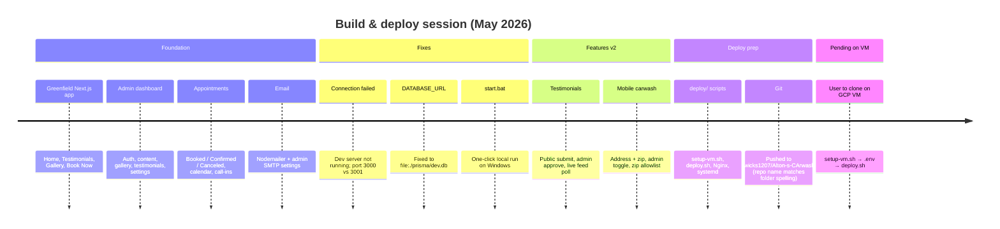
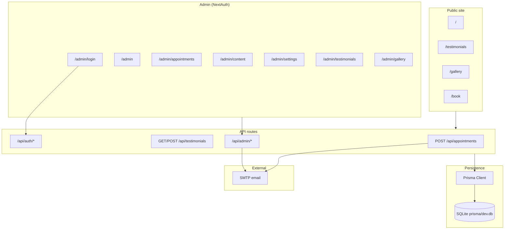
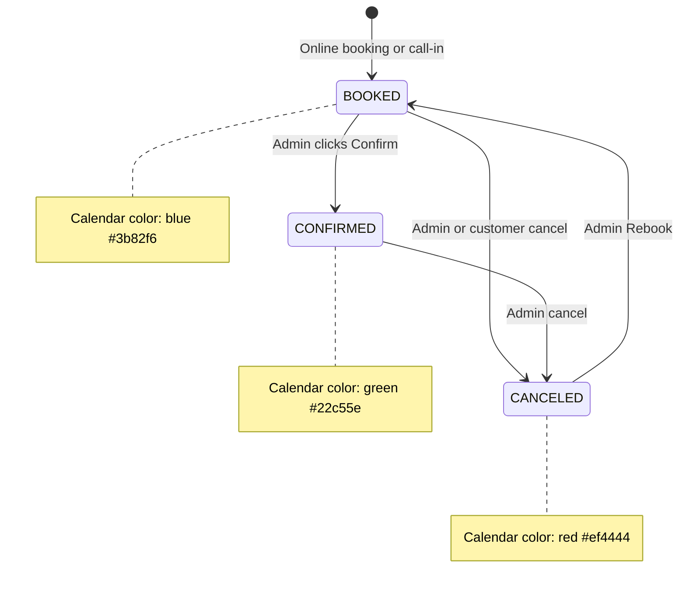
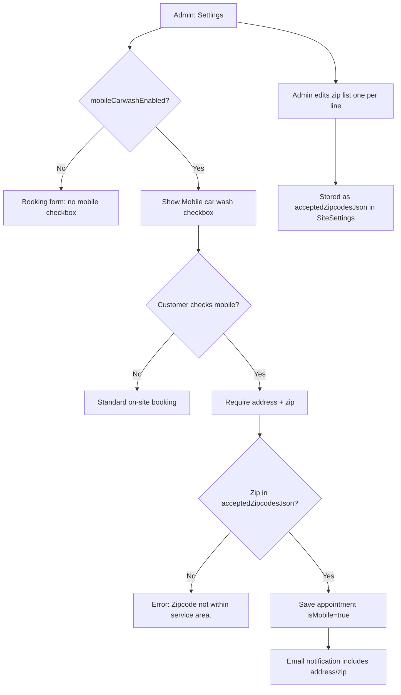
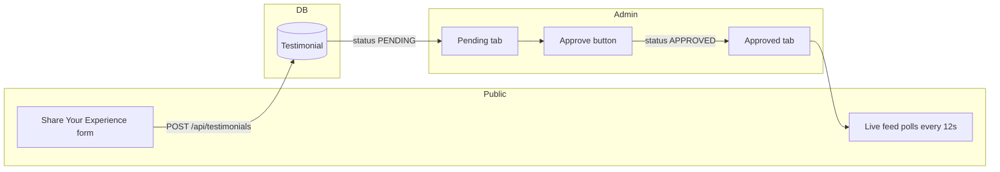
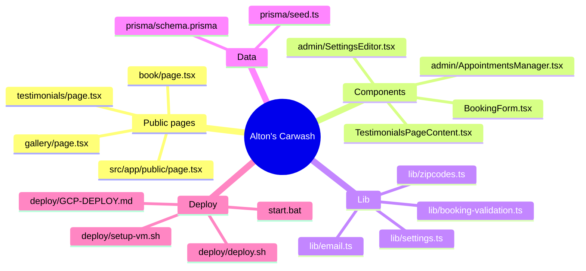
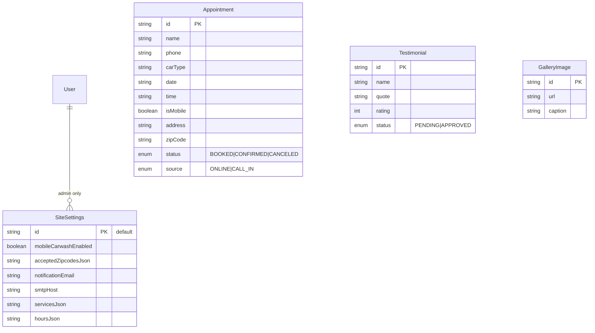
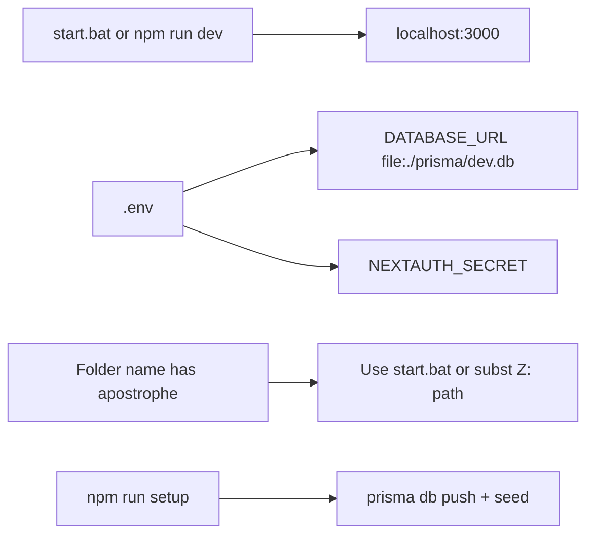
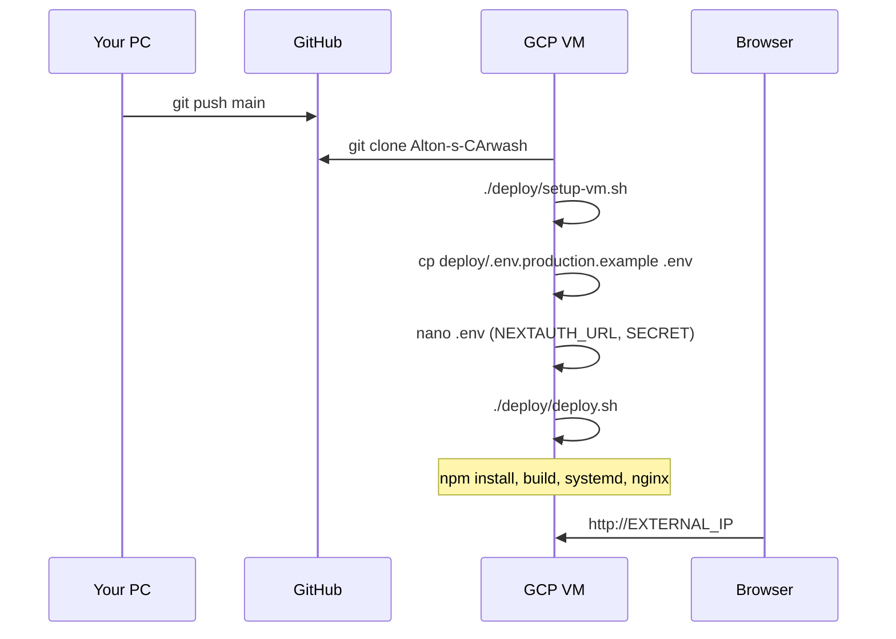

# Alton's Carwash — Project Context & Thread Summary

> **Purpose:** Living reference from the build session (May 2026). Use this when resuming updates so you (or an AI assistant) can recall architecture, decisions, and deployment state without re-reading the full chat.

---

## Quick reference

| Item | Value |
|------|--------|
| **Business name (placeholder)** | Alton's Carwash |
| **GitHub** | https://github.com/jwicks1207/Alton-s-CArwash |
| **Local path** | `C:\Users\Jwick\Desktop\Alton's CArwash` |
| **Stack** | Next.js 15 (App Router), Prisma + SQLite, NextAuth, Nodemailer |
| **Admin login (change in prod)** | `admin@altonscarwash.com` / `changeme123` |
| **Database** | SQLite at `prisma/dev.db` (`DATABASE_URL=file:./prisma/dev.db`) |
| **Deploy target** | Google Cloud Compute Engine VM (Ubuntu) |
| **Recommended VM** | `e2-small` (2 vCPU, 2 GB RAM) for low–mid traffic |

---

## Session timeline (what we built)



---

## System architecture



---

## Appointment lifecycle



---

## Mobile car wash booking flow



---

## Testimonials flow



---

## Key files map



---

## Database models (Prisma)



---

## Local development (Windows)



**Known quirk:** Path `Alton's CArwash` breaks some PowerShell scripts; `subst Z: "C:\Users\Jwick\Desktop\Alton's CArwash"` works for terminal commands.

---

## GCP VM deployment flow



**Clone command on VM:**
```bash
git clone https://github.com/jwicks1207/Alton-s-CArwash.git /var/www/altons-carwash
```

---

## Environment variables

| Variable | Local (.env) | Production (VM) |
|----------|--------------|-----------------|
| `DATABASE_URL` | `file:./prisma/dev.db` | `file:/var/www/altons-carwash/prisma/dev.db` |
| `NEXTAUTH_URL` | `http://localhost:3000` | `http://IP` or `https://domain` |
| `NEXTAUTH_SECRET` | dev secret in .env | `openssl rand -base64 32` |
| `SMTP_*` | optional fallback | optional or set in Admin UI |

**Never commit:** `.env`, `prisma/**/*.db`

---

## Post-deploy checklist

- [ ] Change admin password from `changeme123`
- [ ] Set strong `NEXTAUTH_SECRET` on VM
- [ ] Configure notification email + SMTP in Admin → Settings
- [ ] Add HTTPS with Certbot if using a domain
- [ ] Update `NEXTAUTH_URL` to `https://domain` and re-run `./deploy/deploy.sh`
- [ ] Enable mobile carwash + zip codes when service launches
- [ ] Backup `prisma/dev.db` periodically

---

## Future update ideas (not yet built)

- Admin password change UI
- PostgreSQL for multi-VM / higher scale
- Image upload for gallery (currently URL-only)
- SMS notifications for appointments
- Customer booking confirmation email

---

## How to use this doc with AI

When starting a new chat for updates, say:

> Read `PROJECT-CONTEXT.md` in the Alton's Carwash repo for architecture and prior decisions.

Or attach this file so context is restored quickly.

---

*Last updated: May 24, 2026 — reflects state after git push to `jwicks1207/Alton-s-CArwash`.*
